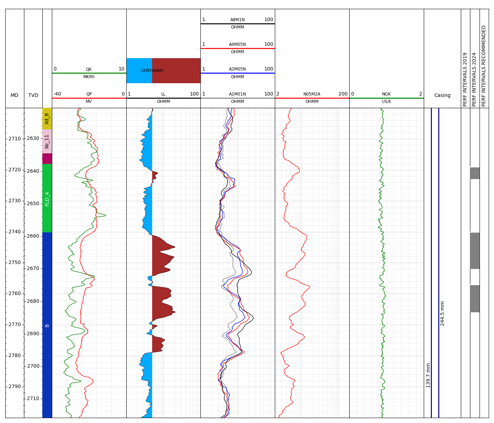
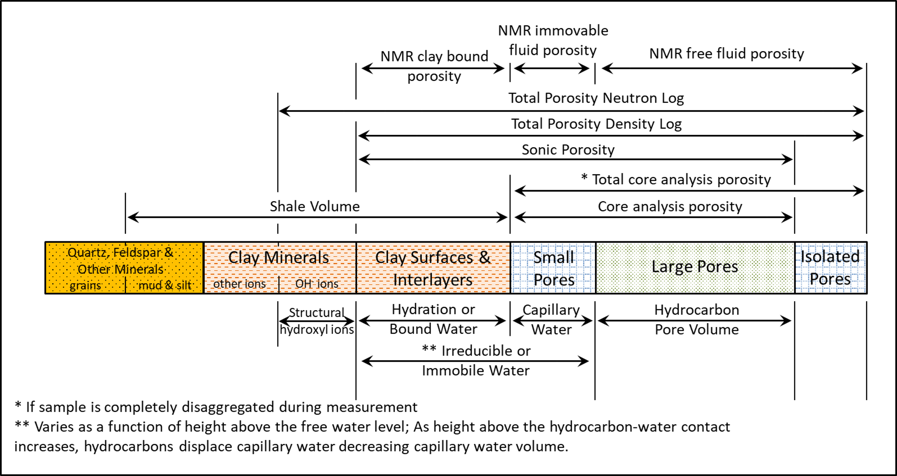
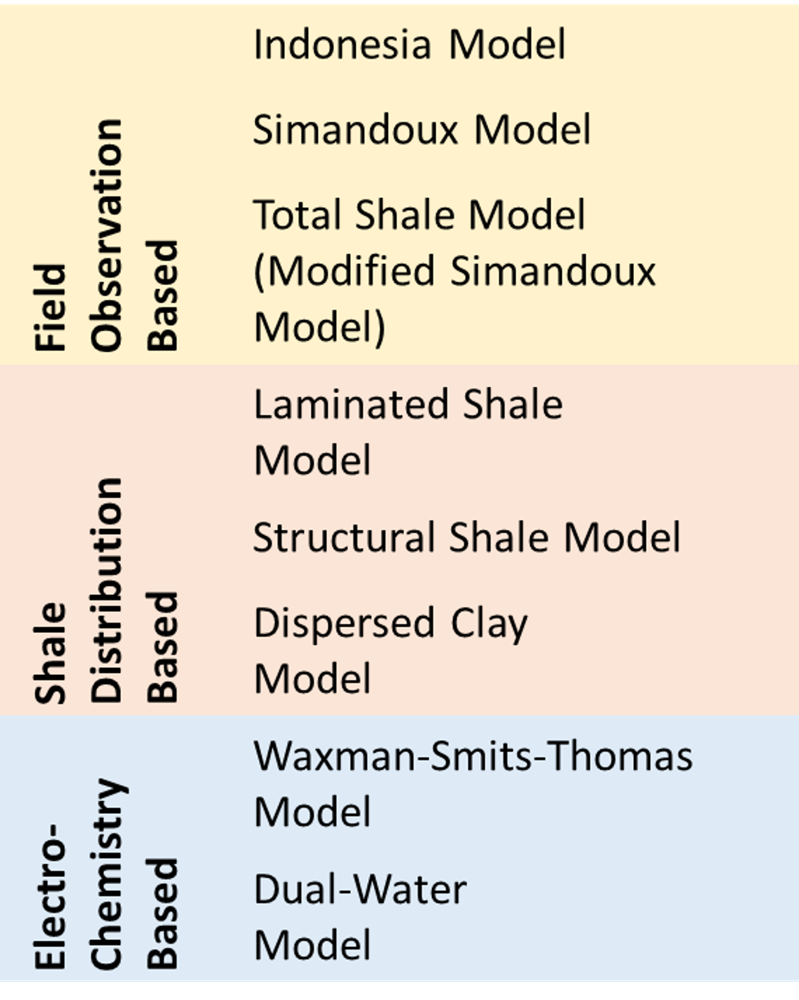
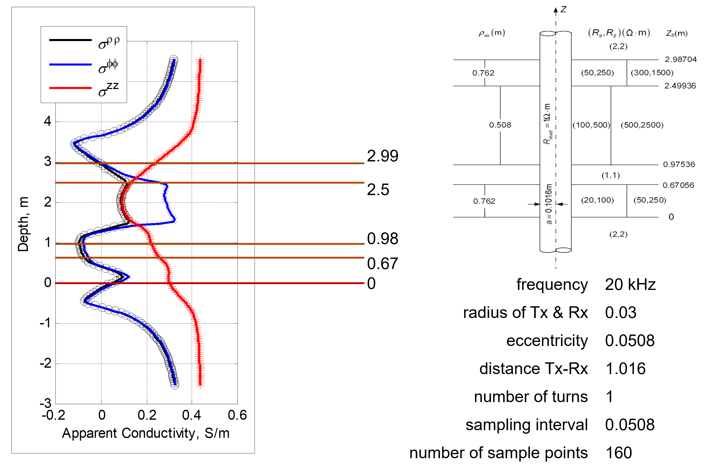

# PPhys

It is a Python package designed for the interpretation of well log data and modeling of the borehole environment. It includes a collection of modules for petrophysical analysis, along with tools for data streaming and interactive visualization, with a primary focus on petrophysical workflows.

Test the commitments (python -m unittest discover -v)

**Stream Module**

The `pphys.stream` module provides tools for rapid, interactive visualization of LAS files using Bokeh. It is designed to offer a lightweight and efficient way to explore well log data directly in the browser, enabling users to quickly assess data quality, identify key log responses, and interact with depth tracks and curves in real time. This module is particularly useful for petrophysicists and geoscientists who need an immediate visual overview of log datasets without the overhead of full-scale interpretation software.

**OnePage Module**

The `pphys.onepage.WellView` module is designed to generate a compact, one-page summary of well log data that integrates key subsurface information. It visually honors formation tops, casing and liner depths, as well as perforation intervals, providing a comprehensive and structured overview of the wellbore in a single figure. This module is ideal for quick-look evaluations, reporting, and presentation purposes, and can be easily customized to suit project-specific visualization standards. An example output is shown below.

*Figure 1: Example output from `WellView` showing log data, formation tops, casing, and perforation intervals.*

The `pphys.onepage.CrossView` module generates a one-page cross-sectional summary that displays multiple wells aligned along a chosen profile. It enables side-by-side comparison of log responses, formation tops, casing details, and perforation intervals across wells, facilitating structural and stratigraphic interpretation. This visualization is especially useful for reservoir correlation, well planning, and presenting subsurface continuity in a concise, publication-ready format. An example output is shown below.

*Figure 2: Example output from `CrossView` showing a cross-sectional view of multiple wells with formation tops, casing depths, and perforation intervals aligned along a shared profile.*

**Insight Module**

The implementation of `pphys.insight` module is shown for a well in a shaly sand formation. The figure below, demonstrated a comparison of porosity measurements by various methods for this case.

*Figure 3: A comparison of porosity measurements by various methods for a shaly sand (Cosentino, 2001)*

The way shaliness affects a log reading depends on the amount of shale and its physical properties. It may also depend on the way the shale is distributed in the formation. A shale or shaly formation may exhibit a high total porosity yet a low effective porosity as a potential hydrocarbon reservoir.

Since the Archie water saturation equation, which relates rock resistivity to water saturation, assumes that the formation water is the only electrically conductive material in the formation, the presence of another conductive material (i.e., shale) requires either that the Archie equation be modified to accommodate the existence of another conductive material or that a new model be developed to relate rock resistivity to water saturation in shaly formations.

Over the years, many models relating resistivity and fluid saturations have been proposed (see the table below). All the models reduce to the Archie water saturation equation when the fraction of shale is zero; for relatively small amounts of shaliness, most models and methods yield quite similar results.

Other models are based on Percolation Theory (Herrick and Kennedy 2009) and Connectivity Theory (Montaron 2009 and Lee 2011).

*Figure 4: Resistivity models for shaly sand formations, available at `pphys.insight` module.*

Following graph shows implementation of the Insight Module to a gas well from which most of the logging measurements were available.

The neutron log is calibrated with respect to limestone, and the overlay is displayed based on limestone characteristics.

The logged interval was not found to be productive, and the NMR results shows almost zero saturation for the gas.

A good agreement is obtained between the total neutron-density and NMR porosities in terms of trend, but the sonic log porosity does not follow them which is expected based on the available literature.

The saturation interpretation is given on the fifth column, total shale model, which agrees with NMR saturation values. All the values calculated are above water saturation cut, 0.35, indicating no hydrocarbon.

*Figure 5: Open Hole Log Interpretation of a Well from South Caspian Basin.*

**MaxWRes Module**

The `pphys.maxwres` module provides a modeling toolbox for simulating induction tool responses based on specified formation conductivity profiles. It is particularly useful for reconstructing mud invasion profiles after drilling, enabling more accurate estimates of saturation from induction log measurements.

The underlying computation is based on solving a series of 2D problems derived from a Fourier series expansion. An axial hybrid method is employed, in which the radial component is solved analytically using normalized Bessel and Hankel functions, while the axial (z-axis) direction is treated numerically. Amplitude and slope basis functions are defined along the discretized wellbore axis, allowing the use of a coarse grid even in complex zones such as fractures, eliminating the need for local grid refinement. This approach leads to both computational efficiency and accurate modeling of borehole-conductivity effects. The method is detailed in Wang et al. (2009).

*Figure 6: Simulated induction tool response for a layered formation with mud invasion, generated using the `maxwres` module. The model captures radial and axial conductivity variations using a hybrid analytical-numerical approach.*